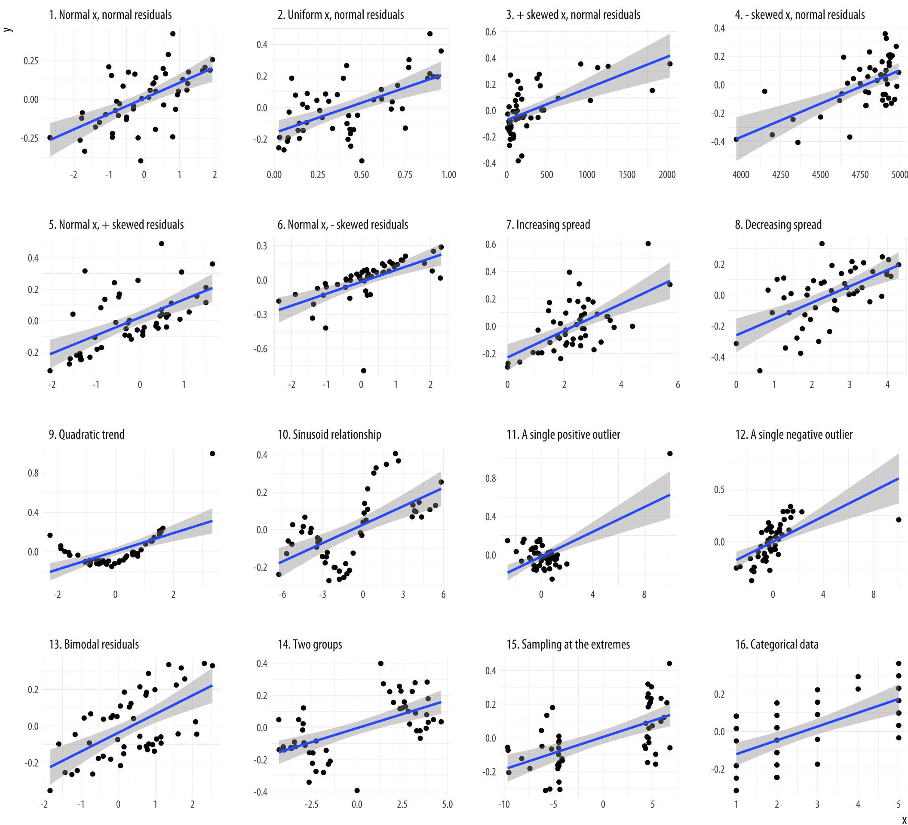

```{r setup, include=FALSE}
options(htmltools.dir.version = FALSE)
knitr::opts_chunk$set(fig.retina = 3, warning = FALSE, message = FALSE)
library(knitr)
library(xaringan)
library(tidyverse)
library(knitr)
library(dplyr)
getwd()
#install.packages("rtools")
# install.packages("renderthis")
library("renderthis")
renderthis::to_pdf("week1-2.html")
# getwd()
```

class: text-slide, title-inv-7
count: FALSE

# Topics
--

.center[.box-1.large[Why make visualizations?]]
--
.center[.box-1.large[Bad visualizations]]
--
.center[.box-1.large[Poster Critique]]
--
.center[.box-1.large[Introduction to R demo, esquisse/ggplot2]]
  
---

class: text-slide, main-slide, center, middle, hide-count

# Why make visualizations?

---

class: text-slide, title-inv-7
count: FALSE

# Anscombe’s quartet

.pull-left[

- Anscombe’s quartet (Anscombe, 1973; Chatterjee & Firat, 2007)
- Each of the four made-up “datasets” contains eleven observations of two variables, x and y. By construction, the numerical properties of each pair of x and y variables, such as their means, are almost identical. Moreover, the standard measures of the association between each x and y pair also match.
- Correlation coefficient 0.81

]

.pull-right[]

<div class="my-footer"><span>https://socviz.co/lookatdata.html</span></div>

---

class: text-slide, title-inv-7
count: FALSE

# A real example, Jackman (1980)

.pull-left[

- A real case from a publication
- The original paper had argued for a significant association between voter turnout and income inequality based on a quantitative analysis of eighteen countries.
- Scatter plot makes it obvious that South Africa impacts the regression line

]

.pull-right[]

<div class="my-footer"><span>https://socviz.co/lookatdata.html</span></div>

---

class: text-slide, title-inv-7
count: FALSE

# Another synthetic example, Jan Vanhove (2016) 

.pull-left[

- The correlation coefficient in all these plots is 0.6
- Data is drawn from a normal distribution
- Again, summary statistics alone can be misleading to the underlying relationship

]

.pull-right[]

<div class="my-footer"><span>https://socviz.co/lookatdata.html; Figure adapted from code by Jan Vanhove</span></div>

---

class: text-slide, main-slide, center, middle, hide-count

# Bad visualizations

---

class: text-slide, title-inv-7, center
count: FALSE

# Bad visualizations

.pull-left[]

.pull-right[]

---

class: text-slide, title-inv-7, center
count: FALSE

# Edward Tufte

### Graphical excellence is the well-designed presentation of interesting data—a matter of substance, of statistics, and of design … [It] consists of complex ideas communicated with clarity, precision, and efficiency. … [It] is that which gives to the viewer the greatest number of ideas in the shortest time with the least ink in the smallest space … [It] is nearly always multivariate … And graphical excellence requires telling the truth about the data. (Tufte, 1983, p. 51).

---

class: text-slide, main-slide, center, middle, hide-count

# Poster Critique

---

class: text-slide, title-inv-7, center
count: FALSE

# Poster Critique (before)


---

class: text-slide, title-inv-7, center
count: FALSE

# Poster Critique (after)


---

class: text-slide, main-slide, center, middle, hide-count

# Demo: introduction to R, esquisse/ggplot2


